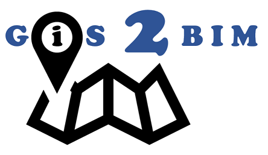

# GIS2BIM OpenAnalysis

**Locatie Analyse & Rapportage Generator voor de Nederlandse Bouwsector**

GIS2BIM OpenAnalysis is een open-source webapplicatie voor het genereren van professionele locatierapporten met Nederlandse geodata. De applicatie combineert kaartlagen van PDOK, Kadaster, BAG, BGT en andere bronnen tot overzichtelijke PDF-rapporten.



## Features

- **Locatie zoeken** - Zoek op adres of klik op de kaart
- **Dubbele coördinaten** - Toon zowel WGS84 als RD (EPSG:28992) coördinaten
- **Preset boekjes** - Voorgedefinieerde kaartlagen voor:
  - Architecten
  - Projectontwikkelaars
  - Bouwhistorici
- **30+ kaartlagen** - Inclusief:
  - Topografie (OpenTopo, TOP10NL)
  - Kadaster (percelen, grenzen)
  - BAG (gebouwen, adressen)
  - BGT (grootschalige topografie)
  - Luchtfoto's (actueel en historisch)
  - AHN hoogtekaart
  - Bestemmingsplannen
  - Natura 2000
  - Bodemkaart
  - Rijksmonumenten
  - Historische kaarten (HisGIS 1832)
- **PDF Generatie** - A3/A4 formaat, liggend/staand
- **DXF Export** - Kadastrale data voor CAD
- **Custom servers** - Voeg eigen WMS/WMTS/WFS servers toe

## Architectuur

```
GIS2BIM-OpenAnalysis/
├── backend/                 # FastAPI backend
│   ├── app/
│   │   ├── api/            # API endpoints
│   │   │   ├── reports.py  # PDF generatie
│   │   │   ├── geocoding.py
│   │   │   ├── layers.py
│   │   │   ├── servers.py  # Server management
│   │   │   └── presets.py  # Boekje presets
│   │   ├── services/       # Business logic
│   │   │   ├── map_service.py
│   │   │   ├── pdf_generator.py
│   │   │   └── dxf_generator.py
│   │   └── main.py
│   └── requirements.txt
├── mockup/                  # Frontend (vanilla JS)
│   ├── index.html
│   ├── app.js
│   ├── layers-data.js
│   └── styles.css
├── servers.json            # Server configuraties
├── presets.json            # Preset definities
└── output/                 # Gegenereerde PDFs
```

## Installatie

### Vereisten

- Python 3.10+
- Node.js (optioneel, voor development)

### Backend Setup

```bash
# Clone repository
git clone https://github.com/yourusername/GIS2BIM-OpenAnalysis.git
cd GIS2BIM-OpenAnalysis

# Maak virtual environment
cd backend
python -m venv venv
source venv/bin/activate  # Linux/Mac
# of: venv\Scripts\activate  # Windows

# Installeer dependencies
pip install -r requirements.txt

# Start de server
uvicorn app.main:app --reload --host 0.0.0.0 --port 8000
```

### Toegang

Open http://localhost:8000 in je browser.

## API Endpoints

### Reports

| Endpoint | Method | Beschrijving |
|----------|--------|--------------|
| `/api/reports/generate-direct` | POST | Genereer PDF rapport |
| `/api/reports/download-dxf` | POST | Download Kadaster als DXF |

### Servers

| Endpoint | Method | Beschrijving |
|----------|--------|--------------|
| `/api/servers/` | GET | Lijst alle servers |
| `/api/servers/` | POST | Voeg nieuwe server toe |
| `/api/servers/{id}` | GET | Server details |
| `/api/servers/{id}/capabilities` | GET | GetCapabilities |

### Presets

| Endpoint | Method | Beschrijving |
|----------|--------|--------------|
| `/api/presets/` | GET | Lijst alle presets |
| `/api/presets/{id}` | GET | Preset details |
| `/api/presets/` | POST | Maak nieuwe preset |

### Geocoding

| Endpoint | Method | Beschrijving |
|----------|--------|--------------|
| `/api/geocoding/search` | GET | Zoek adres (PDOK Locatieserver) |

## Configuratie

### Servers (servers.json)

```json
{
  "servers": [
    {
      "id": "pdok-luchtfoto",
      "name": "PDOK Luchtfoto's",
      "url": "https://service.pdok.nl/hwh/luchtfotorgb/wms/v1_0",
      "type": "WMS",
      "layers": ["Actueel_orthoHR"],
      "crs": ["EPSG:28992", "EPSG:4326"],
      "category": "luchtfoto"
    }
  ]
}
```

### Presets (presets.json)

```json
{
  "presets": [
    {
      "id": "architect",
      "name": "Architect",
      "description": "Kaarten voor architecten",
      "layers": [
        {
          "serverId": "pdok-luchtfoto",
          "layer": "Actueel_orthoHR",
          "title": "Luchtfoto Actueel"
        }
      ]
    }
  ]
}
```

## Gebruikte Services

### PDOK (Publieke Dienstverlening Op de Kaart)

- [service.pdok.nl](https://www.pdok.nl/)
- Kadaster, BAG, BGT, AHN, Luchtfoto's, TOP10NL, etc.

### Overige bronnen

- HisGIS - Historische kadaster 1832
- CBS - Statistieken
- RVO - Natura 2000
- RCE - Rijksmonumenten

## Coördinatensystemen

| Systeem | EPSG | Beschrijving |
|---------|------|--------------|
| WGS84 | 4326 | Wereldwijd (lat/lng) |
| RD (Rijksdriehoek) | 28992 | Nederlands nationaal |
| Web Mercator | 3857 | Web tiles |

## Development

### API Documentatie

- Swagger UI: http://localhost:8000/api/docs
- ReDoc: http://localhost:8000/api/redoc

### Project Dependencies

**Backend (Python):**
- FastAPI - Web framework
- Pillow - Image processing
- reportlab - PDF generation
- ezdxf - DXF generation
- httpx - HTTP client
- pyproj - Coordinate transformations

## Licentie

Dit project is open source onder de MIT licentie.

## Credits

Ontwikkeld door de [OpenAEC Foundation](https://openaec.org).

Gebaseerd op het [GIS2BIM](https://github.com/DutchSailor/GIS2BIM) project.

---

**Powered by OpenAEC Foundation**
